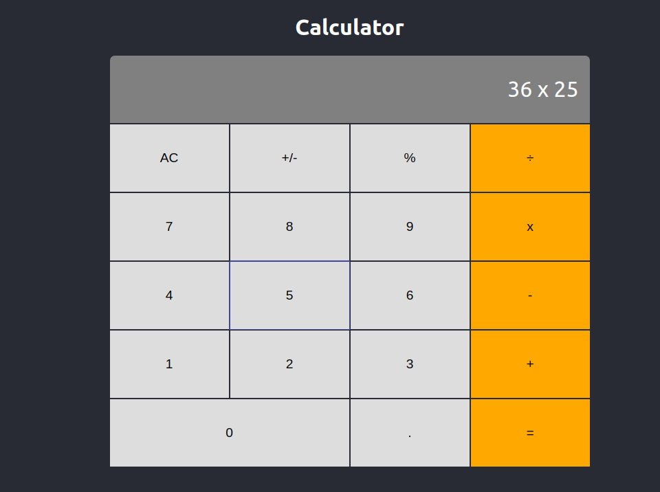
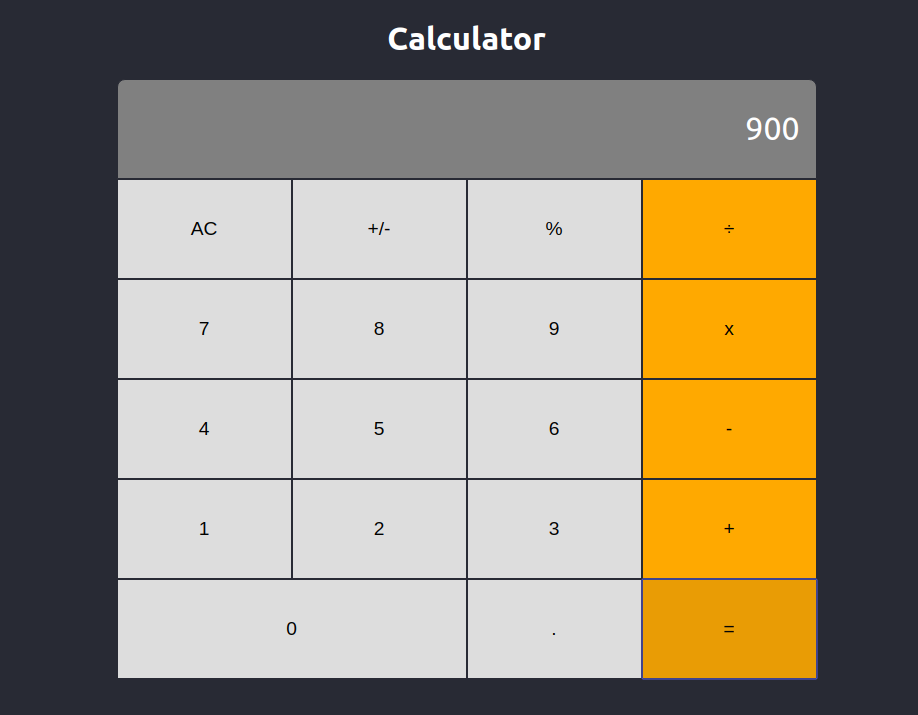

# Calculator

The goal is to design a browser based calculator application for a fictional company `"Maths Magicians"` using [React](https://reactjs.org/).

This project was bootstrapped with [Create React App](https://github.com/facebook/create-react-app).

## Tools and/or technology stack for the project
  - Node.js
  - React
  - ReactDOM
  - Create-React-App
  - NPM
  - CSS
  - ES6
  - Jest

## Getting Started

Clone this repository on your machine.

### Available Scripts

In the project directory, you can run:

#### `npm start`

Runs the app in the development mode. 
Open [http://localhost:3000](http://localhost:3000) to view it in the browser.

The page will reload if you make edits. 
You will also see any lint errors in the console.

#### `npm test`

Launches the test runner in the interactive watch mode. 
See the section about [running tests](https://facebook.github.io/create-react-app/docs/running-tests) for more information.

#### `npm run build`

Builds the app for production to the `build` folder. 
It correctly bundles React in production mode and optimizes the build for the best performance.

The build is minified and the filenames include the hashes. 
Your app is ready to be deployed!

See the section about [deployment](https://facebook.github.io/create-react-app/docs/deployment) for more information.

## Screenshots

| Operation | Result |
|-------|-------|
|  |  |

## Features To Add

Calculator input is not reset after the result is evaluated, when a user clicks on a digit it just appends it to the old result. This implies that the user has to clear the screen after each operation, in order to begin performing the next computation/operation. This behavior will be rectified in the next version.

## Authors

* [**Edward Iga Kigongo**](github.com/igakigongo)

## License

The project and all associated source code are free for redistribution and modification.